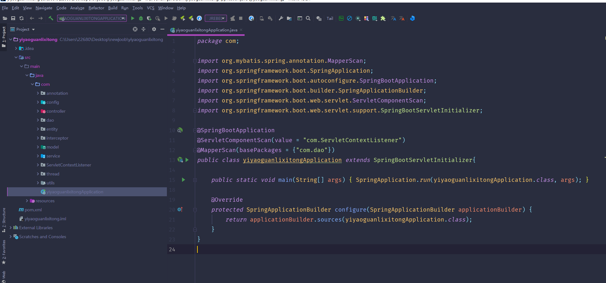
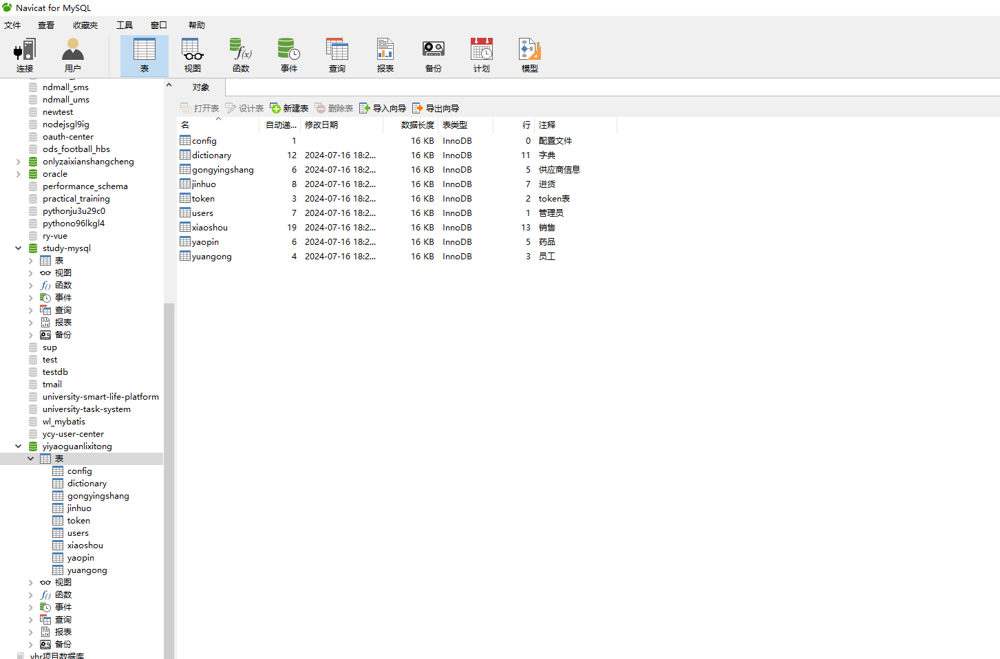
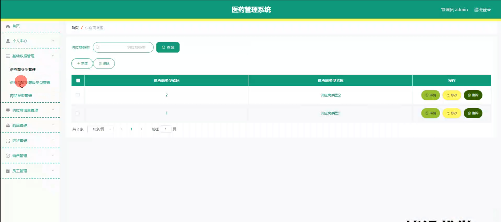
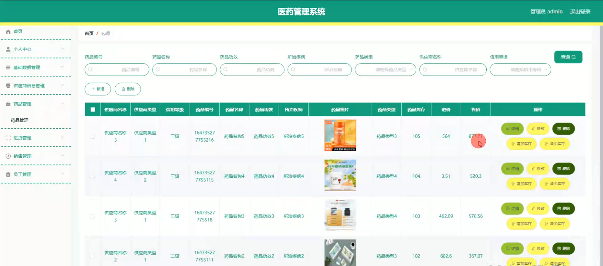
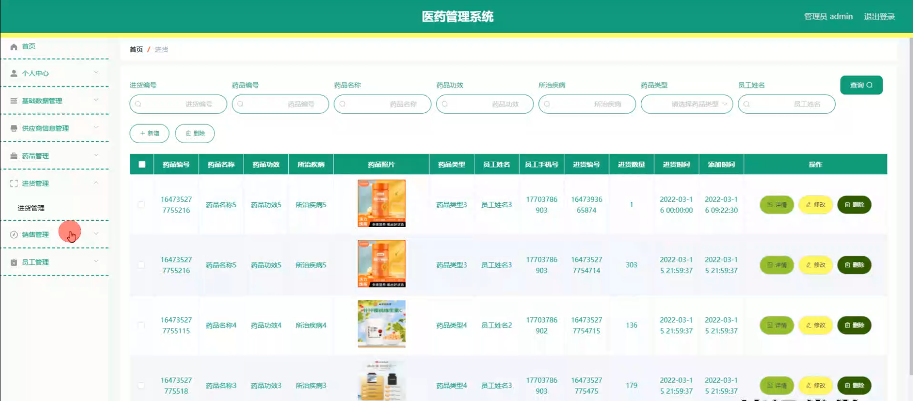
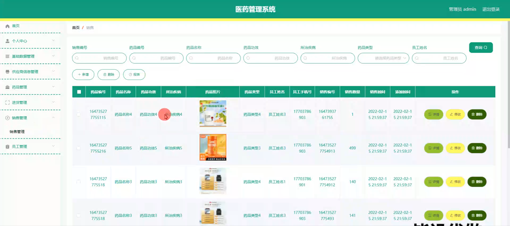
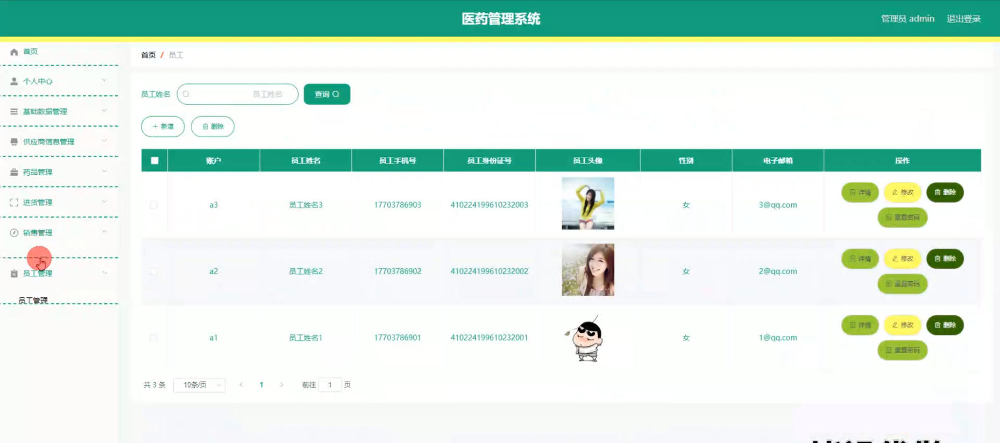
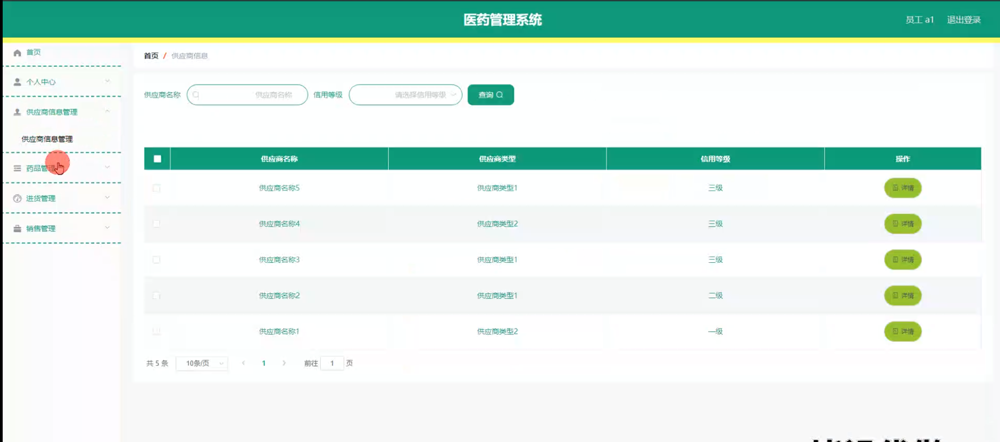
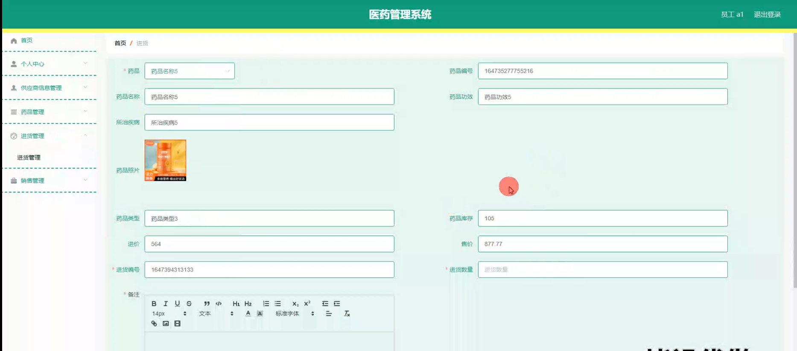

# 基于springboot的医药管理系统

<h4 style='color:red'>联系不到我，就看我的主页 </h4> 
 
#### 介绍

基于Spring Boot的医药管理系统旨在通过信息化手段提升医药行业的管理效率和服务质量。随着医药行业的快速发展，传统的手工管理方式已经无法满足现代化管理的需求。本系统通过整合供应商信息、药品管理、进货及销售管理等功能模块，实现了信息的高度集中和管理的自动化，提高了工作效率，减少了人为错误。同时，系统提供了两种角色：管理员和员工，分别对应不同的权限和功能模块，以满足不同用户的需求。

#### 技术栈

后端技术栈：Springboot+Mysql+Maven

前端技术栈：Vue+Html+Css+Javascript+ElementUI

开发工具：Idea+Vscode+Navicate

#### 系统功能介绍

管理员角色功能模块：  
个人中心：  
个人信息管理：管理员可以查看和修改自己的个人信息，包括姓名、联系方式、密码等。  
通知公告：管理员可以接收系统通知和公告，及时了解系统更新和重要事项。  
供应商信息管理：  
供应商信息录入：管理员可以添加新的供应商信息，包括供应商名称、联系方式、地址等。  
供应商信息修改：管理员可以修改现有供应商的信息。  
供应商信息查询：管理员可以根据不同条件查询供应商信息，方便快速找到所需信息。  
药品管理：  
药品信息录入：管理员可以添加新的药品信息，包括药品名称、规格、生产厂家、有效期等。  
药品信息修改：管理员可以修改现有药品的信息。  
药品库存管理：管理员可以查看药品的库存情况，及时进行补货。  
进货管理：  
进货单录入：管理员可以录入新的进货单，包括进货药品、数量、价格、供应商等信息。  
进货单审核：管理员可以审核进货单，确保进货信息的准确性。  
进货记录查询：管理员可以查询历史进货记录，方便进行统计和分析。  
销售管理：  
销售单录入：管理员可以录入新的销售单，包括销售药品、数量、价格、客户等信息。  
销售单审核：管理员可以审核销售单，确保销售信息的准确性。  
销售记录查询：管理员可以查询历史销售记录，方便进行统计和分析。  
员工管理：  
员工信息录入：管理员可以添加新的员工信息，包括员工姓名、联系方式、职位等。  
员工信息修改：管理员可以修改现有员工的信息。  
员工权限管理：管理员可以设置员工的权限，确保员工只能访问和操作与其职位相关的功能模块。  

员工角色功能模块：    
个人中心：  
个人信息管理：员工可以查看和修改自己的个人信息，包括姓名、联系方式、密码等。  
通知公告：员工可以接收系统通知和公告，及时了解系统更新和重要事项。  
供应商信息管理：  
供应商信息查询：员工可以根据不同条件查询供应商信息，方便快速找到所需信息。  
药品管理：  
药品信息查询：员工可以查询药品信息，包括药品名称、规格、生产厂家、有效期等。  
药品库存查询：员工可以查看药品的库存情况，及时进行补货建议。  
进货管理：  
进货单录入：员工可以录入新的进货单，包括进货药品、数量、价格、供应商等信息。  
进货记录查询：员工可以查询历史进货记录，方便进行统计和分析。  
销售管理：  
销售单录入：员工可以录入新的销售单，包括销售药品、数量、价格、客户等信息。  
销售记录查询：员工可以查询历史销售记录，方便进行统计和分析。  
 
#### 系统作用

本系统在医药管理领域中发挥了重要作用，主要体现在以下几个方面：  
提高管理效率：通过信息化手段，系统实现了药品、供应商、进货和销售等信息的集中管理，减少了人工操作，提高了工作效率。  
减少人为错误：系统通过自动化流程，减少了人为错误的发生，确保了数据的准确性和一致性。  
实时数据查询：系统提供了强大的查询功能，管理员和员工可以实时查询所需信息，方便进行决策和管理。  
权限管理：系统通过角色权限管理，确保了不同角色只能访问和操作与其职责相关的功能模块，增强了系统的安全性和数据的保密性。  
数据统计与分析：系统提供了进货和销售数据的统计与分析功能，帮助管理者了解业务状况，制定科学的经营策略。  
信息透明化：通过系统，供应商信息、药品信息、进货和销售记录等数据透明化，方便追溯和管理，提升了企业的管理水平。  

#### 系统功能截图

代码结构

数据库表

登录

基础数据管理

药品管理

进货管理

销售管理

员工管理

员工端供应商信息管理

进货详情

#### 总结

基于Spring Boot的医药管理系统在医药行业的信息化管理中具有重要意义。随着医药行业的快速发展，传统的手工管理方式已经难以满足现代化管理的需求。通过本系统，企业可以实现药品、供应商、进货和销售等信息的集中管理，提高工作效率，减少人为错误，增强数据的准确性和一致性。
然而，尽管本系统在提升医药管理效率方面取得了显著成效，但仍存在一些局限性。例如，系统的可扩展性和灵活性可能需要进一步提升，以适应不断变化的业务需求。此外，系统的用户界面和用户体验也有待进一步优化，以提高用户的使用满意度。
未来，随着技术的不断进步和业务需求的不断变化，本系统将不断进行优化和升级，以更好地满足医药行业的信息化管理需求。通过持续的技术创新和用户反馈，我们相信本系统将为医药管理带来更大的价值和贡献。

#### 使用说明

创建数据库，执行数据库脚本 修改jdbc数据库连接参数 下载安装maven依赖jar 启动idea中的springboot项目

后台登录页面
http://localhost:8080/yiyaoguanlixitong/admin/dist/index.html

管理员				账户:admin 		密码：admin

员工				账户:a1 		密码：123456